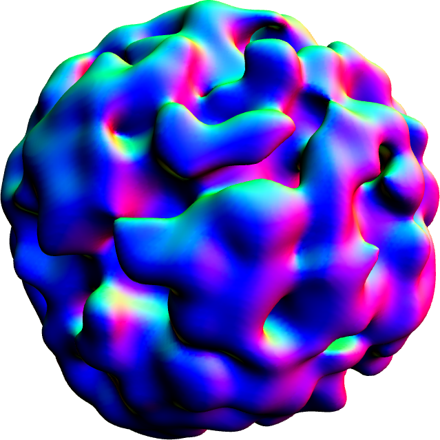

# isosurface-generator

A JS generator function that returns a mesh describing an isosuface given a density and level. Since it's
a generator function, you can perform this expensive calculation in a way that allows you to keep your UI
responsive.

[DEMO](https://wwwtyro.github.io/isosurface-generator)

<p align="center">
  
</p>

## Install

```sh
npm install isosurface-generator
```

## Example

```js
const isosurfaceGenerator = require('isosurface-generator');
const ndarray = require('ndarray');

const size = 8;

const density = ndarray(new Float32Array(size*size*size), [size, size, size]);

for (let i = 0; i < 1000; i++) {
  density.set(
    Math.floor(Math.random() * size),
    Math.floor(Math.random() * size),
    Math.floor(Math.random() * size),
    Math.random()
  );
}

let mesh;

for (let data of isosurfaceGenerator(density, 0.5)) {
  mesh = {
    positions: data.positions,
    cells: data.cells,
  };
  console.log('Fraction complete:', data.fraction);
  // await display update
}
```

## API

### require('isosurface-generator')(density, level)

#### Parameters

`density` is an [ndarray](https://github.com/scijs/ndarray) (or an object that implements ndarray's `.get` method and `.shape` attribute)

`level` is the density value for which we're generating an isosurface

#### Return value

A generator function that will provide a mesh describing the isosurface mesh and the fraction complete:

```js
const generator = isosurfaceGenerator(density, 0.5);

generator.next();

// Returns {
//   value: {
//     positions: [[1,2,3], [4,5,6], ...],
//     cells: [[1,2,3], [4,5,6], ...],
//     fraction: 0.009
//   },
//   done: false
// }
```

## Resources

- https://0fps.net/2012/07/12/smooth-voxel-terrain-part-2
